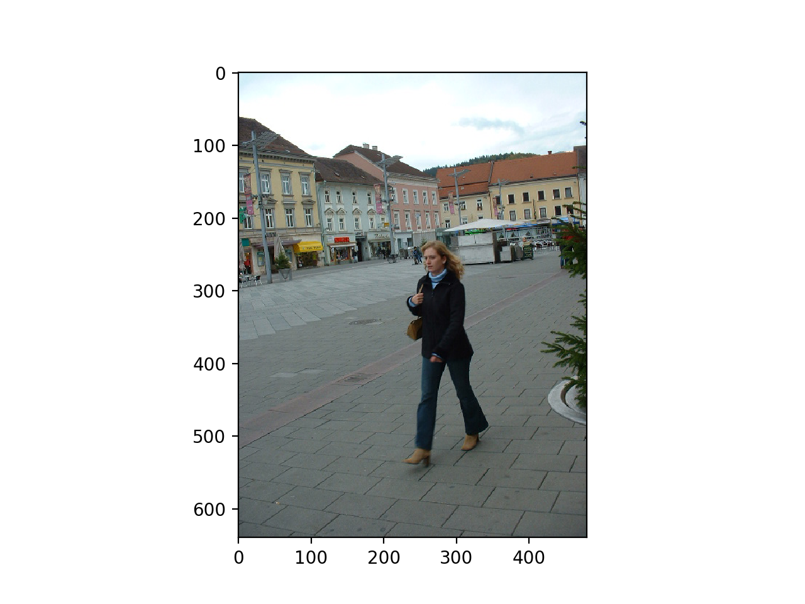
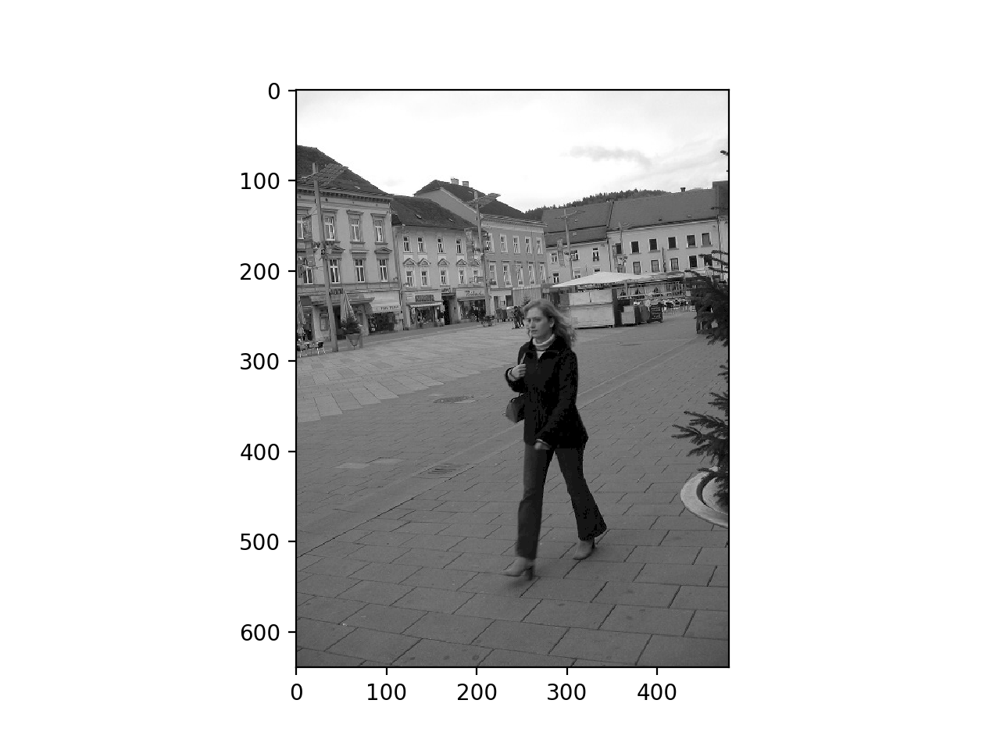
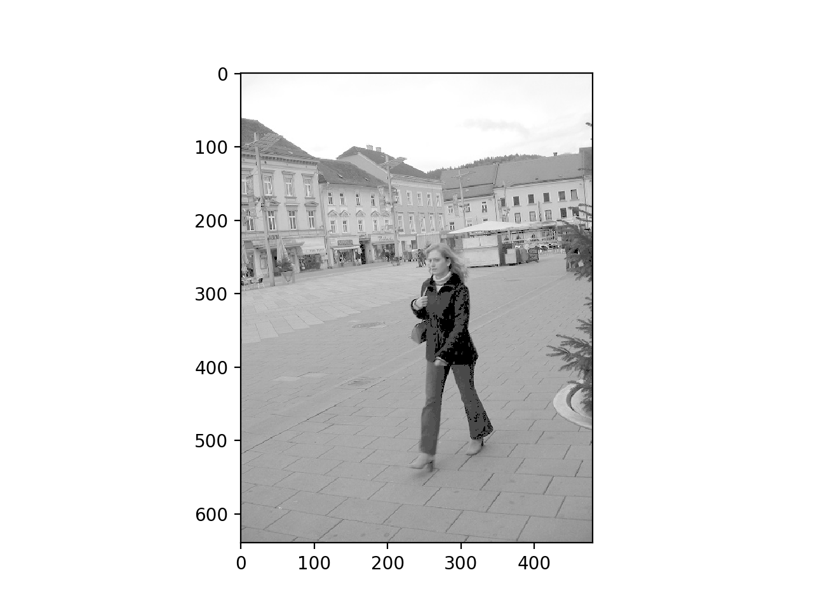
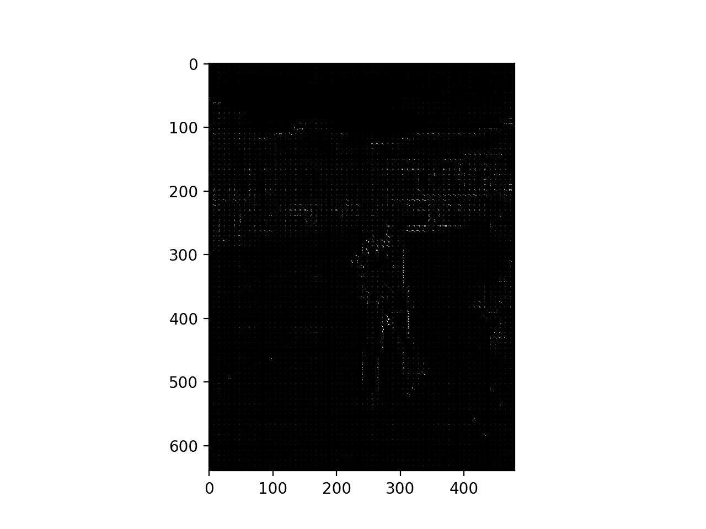

# HOG_descriptor

This code is implemented from the bottom of the hog algorithm by python. [Peng Zhaoqing](https://github.com/PENGZhaoqing) optimized this code and improved some computing speed. You can use two versions of the code. The first version is an integrated version and easy to call. The second version is implemented step by step, easy for readers to understand. You can learn more details from this [website](https://zpdesu.github.io/documents/HOG特征提取/)

## Prerequisite
* [OpenCV]
* [matplotlib]
* [Numpy]

## Usage

```
$ git clone https://github.com/ZPdesu/HOG_descriptor
$ cd HOG_descriptor
```
change the image name in hog_feature1.py or hog_feature2.py, then run it.

## case images




## feature map

